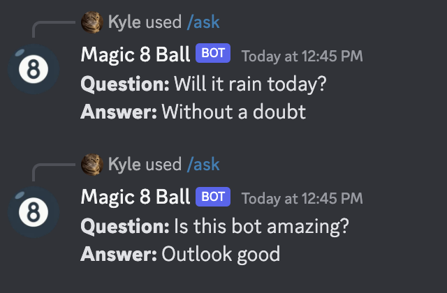

# Magic 8 Ball Discord Bot

This Discord bot emulates a Magic 8 Ball and will respond to any questions you might want to ask it.



## Running the Bot

#### Prerequisites
- Node.js 16+

First, set the prerequisite environment variables:
```
export MAGIC_8_BALL_CLIENT_ID="<your_bot_client_id>"
export MAGIC_8_BALL_TOKEN="<your_bot_token>"
```

Start it with:
```
npm install
npm run start
```